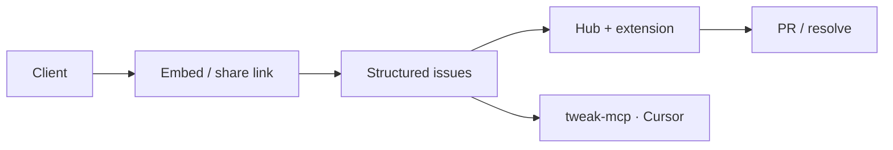
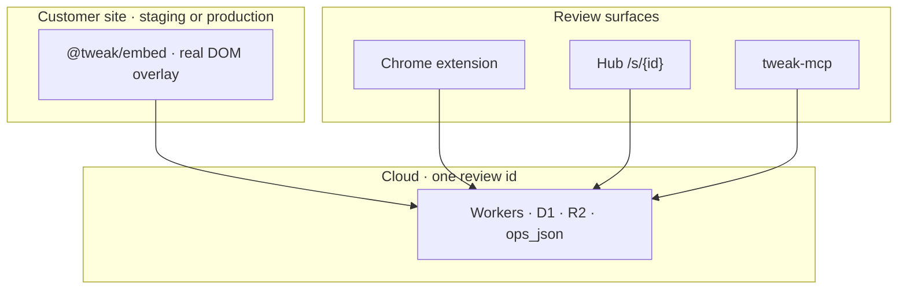
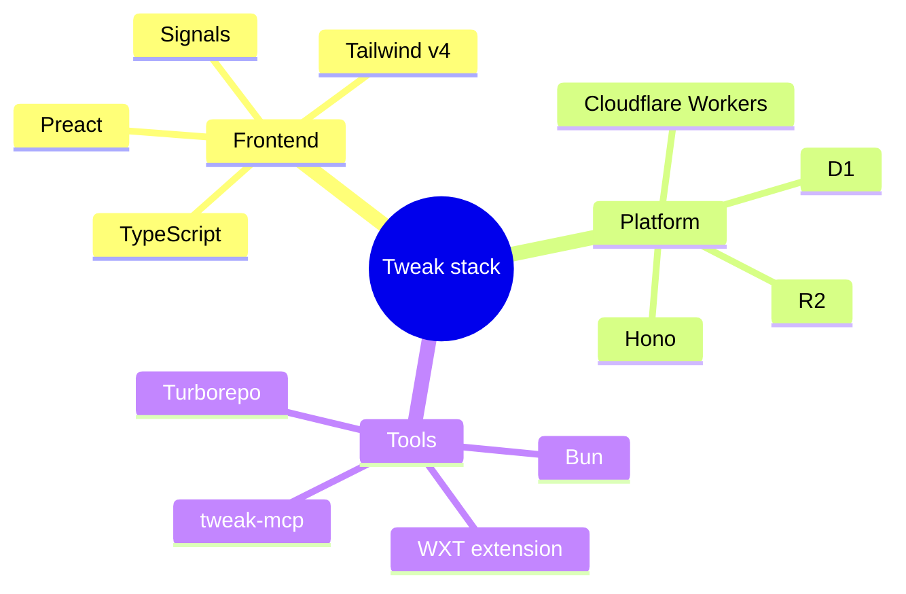
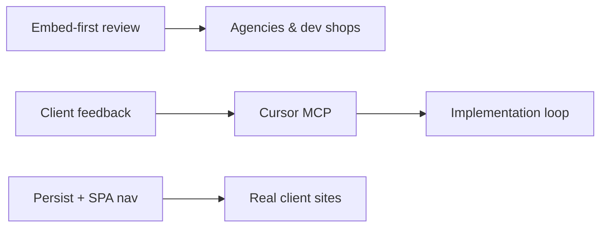

<!-- GitHub profile README — dark variant -->
<!-- Repo: github.com/hrushikeshvetagiri-tweak/hrushikeshvetagiri-tweak -->

 

  

### Vetagiri Hrushikesh

**Founder & builder** · building [**Tweak**](https://tweak.page)

*Review live websites in the browser. Turn feedback into code.*

 

---

## About

I build **live website review infrastructure** — the layer between vague client feedback and merged code.

Screenshot threads and Slack messages lose selectors, scroll context, and intent. **Tweak** keeps feedback on the **real DOM**: clients pin issues on staging or production; developers triage in a hub, resolve work, and optionally hand structured issues to AI via MCP.

---

## Tweak at a glance

| Role | Experience |
|------|------------|
| **Clients** | Share link or on-site embed — comment, inspect, draw. No install. |
| **Developers** | Chrome extension + hub `/s/{id}` — claim, Go To, link PRs, resolve. |
| **AI (optional)** | `tweak-mcp` — canonical issues in Cursor, VS Code, Claude. |

**Live-site-first** · **One review, one truth** · **Embed + extension, one overlay** · **AI-native MCP**

→ [tweak.page](https://tweak.page) · [Chrome Web Store](https://chromewebstore.google.com/detail/tweak/fnfobegjifomgobgilaemihpcpidjamc)

---

## GitHub activity

 

---

## Stack

---

## Focus now

- Embed-first review for agencies and dev shops
- Client feedback → Cursor MCP → implementation loop
- Persist, SPA navigation, and multi-tab integrity on real client sites

---

**Building in public.**

[Try Tweak on your staging URL](https://tweak.page) · [GitHub](https://github.com/hrushikeshvetagiri-tweak)

 

