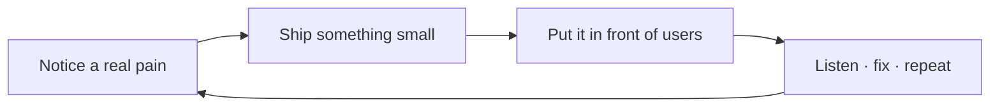

<h1 align="center">Hey, I'm Hrushikesh 👋</h1>

<h3 align="center">Vetagiri Hrushikesh · technical founder · builder</h3>

  

  I like taking messy, everyday problems and shipping software that actually fits how people work.

  
  
  

---

> I'm a developer who started noticing the same frustration on every client project:
> feedback arrives as screenshots and vague messages, and someone still has to **guess the selector**.
> So I stopped waiting for the perfect tool and started building one.

### About me

- **Who I am** — developer turned founder, learning sales and customer conversations the same way I learned to code: by doing it badly first, then better
- **How I think** — start with the problem, not the stack; if a client can't use it without a manual, I haven't finished
- **What I care about** — shipping on real client sites (SPAs, staging URLs, messy production DOMs), not demo-ware
- **Where I am** — Hyderabad, building [**Tweak**](https://tweak.page) and talking to agencies & dev shops who live in the screenshot → Slack → guess loop

---

<strong>What I'm doing right now</strong>

 

Building **[Tweak](https://tweak.page)** — the product I wished existed when clients sent screenshot folders instead of clear feedback.

One line: **live website review on the real page**, for teams who ship sites for other people.

That's my main focus. Everything else — outreach, demos, docs, MCP — supports getting that into the hands of people who feel the same pain I did.

  <a href="https://tweak.page">tweak.page</a>
  ·
  <a href="https://chromewebstore.google.com/detail/tweak/fnfobegjifomgobgilaemihpcpidjamc">Chrome extension</a>
  ·
  <a href="https://github.com/tweak-page">@tweak-page</a>

<strong>How I build</strong>

 

I work across the stack — UI on the page, extension, API, infra — because the hard part is how it all connects on a **real** site, not in a slide deck.

`TypeScript` · `Preact` · `Cloudflare Workers` · `D1` · `R2` · `Bun` · `WXT` · `MCP`

Things I'm actively getting better at: founder conversations, saying no to scope creep, and shipping before the architecture diagram is perfect.

<strong>Outside the code</strong>

 

- Rehearsing how to explain what I build (out loud, not just in docs)
- Meeting founders and agency owners who've felt the same feedback pain
- Trying to be useful before being loud — build in public, not perform in public

---

<h3 align="center">GitHub activity</h3>

  
  

  

---

  <strong>Always happy to connect</strong> — especially if you ship websites, run an agency, or are figuring out founder life too. 
  <a href="mailto:hrushikesh.vetagiri@tweak.page">hrushikesh.vetagiri@tweak.page</a>

  <a href="https://github.com/hrushikeshvetagiri-tweak">@hrushikeshvetagiri-tweak</a>

