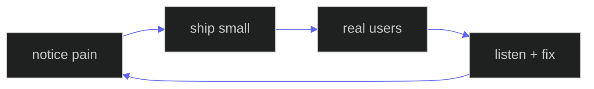

  

  

<h3 align="center">Vetagiri Hrushikesh</h3>

<em>technical founder · builder · hyderabad</em>

  
  
  

  

  I take messy, everyday problems and ship software that fits how people actually work.

 

<table width="100%">
  <tr>
    <td width="33%" align="center" valign="top">

**🧠 who**

developer → founder  
learning sales the same way I learned code — by doing

  </td>
    <td width="33%" align="center" valign="top">

**⚡ how**

problem first, stack second  
if it breaks on a real client site, it's not done

  </td>
    <td width="33%" align="center" valign="top">

**🎯 now**

building [**Tweak**](https://tweak.page)  
for teams stuck in screenshot → slack → guess

  </td>
  </tr>
</table>

 

> *Every client project had the same friction — feedback as screenshots, someone guessing the selector. I stopped waiting for the perfect tool and started building.*

 

  

 

  

<table width="100%">
  <tr>
    <td width="50%" valign="top">

<b>what i'm building</b>

 

**[Tweak](https://tweak.page)** — live website review on the real page. The tool I wished existed when clients sent screenshot folders.

→ [tweak.page](https://tweak.page) · [extension](https://chromewebstore.google.com/detail/tweak/fnfobegjifomgobgilaemihpcpidjamc) · [@tweak-page](https://github.com/tweak-page)

  </td>
    <td width="50%" valign="top">

<b>how i build</b>

 

full stack — overlay, extension, API, infra. The hard part is making it work on **real** sites.

`TypeScript` · `Preact` · `Workers` · `D1` · `Bun` · `MCP`

<b>outside code</b>

 

rehearsing pitches out loud · meeting founders · useful before loud

  </td>
  </tr>
</table>

 

  

  
  

  

 

  

  especially if you ship websites, run an agency, or are figuring out founder life 
  <a href="mailto:hrushikesh.vetagiri@tweak.page"><b>hrushikesh.vetagiri@tweak.page</b></a>

  <a href="https://github.com/hrushikeshvetagiri-tweak">@hrushikeshvetagiri-tweak</a>

  

