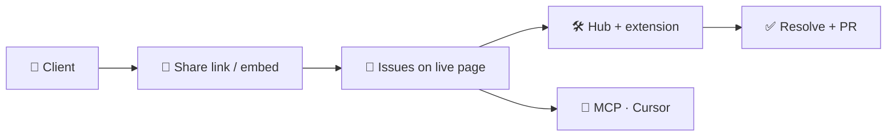
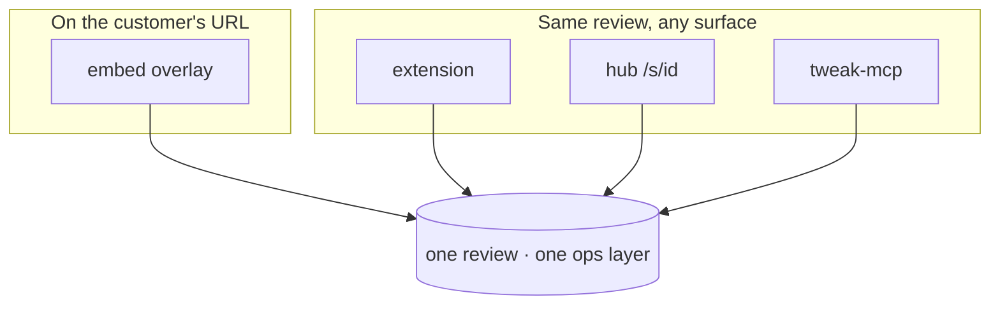

<h1 align="center">Hey, I'm Hrushikesh 👋</h1>

  <strong>Founder of <a href="https://tweak.page">Tweak</a></strong> — live website review on the real DOM

  

  
  
  

---

> **Clients don't send CSS selectors in Slack.** They send screenshots.
> I built Tweak so feedback stays on the **live page** — pinned to real elements — and flows straight to developers (and AI) as structured issues.

<table>
  <tr>
    <td width="50%" valign="top">

### 😩 The old loop

- Screenshot → email → guess the element
- Context lost on every reply
- "Which button?" threads for days
- AI gets a PNG, not a selector

  </td>
  <td width="50%" valign="top">

### ✨ With Tweak

- Client opens your **staging URL**
- Pins land on the **real DOM**
- Dev jumps to exact spot via hub
- Optional **MCP** handoff in Cursor

  </td>
  </tr>
</table>

---

<strong>What Tweak is</strong>

 

**Embed-first website review** — not a screenshot tool, not Jira.

| Who | What they do |
|:--|:--|
| **Clients** | Comment on the live site via share link or embed. No install. |
| **Developers** | Chrome extension + hub — claim, Go To, link PRs, resolve. |
| **AI** | `tweak-mcp` exposes canonical issues to Cursor / Claude. |

  <a href="https://tweak.page"><strong>Try it → tweak.page</strong></a>

<strong>Stack I ship with</strong>

 

`Preact` · `Signals` · `TypeScript` · `Tailwind` · `Cloudflare Workers` · `D1` · `R2` · `Hono` · `WXT` · `MCP` · `Bun` · `Turborepo`

**Right now:** embed-first review for agencies · MCP feedback loop · persist on messy real-world SPAs

---

<h3 align="center">GitHub</h3>

  
  

  

---

  <strong>Building in public.</strong> 
  Review websites for clients? <a href="https://tweak.page">Drop Tweak on your staging URL</a> — takes minutes.

  <a href="https://github.com/hrushikeshvetagiri-tweak">@hrushikeshvetagiri-tweak</a>
  ·
  <a href="https://github.com/tweak-page">@tweak-page</a>

