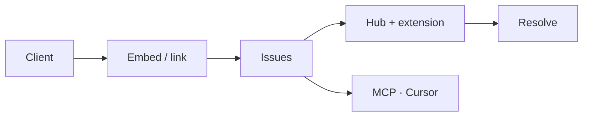

<!-- GitHub profile README — minimal dark variant -->

 

  

### Vetagiri Hrushikesh

Founder · [**Tweak**](https://tweak.page)

*Live website review on the real DOM — feedback to code.*

 

---

I replace screenshot-and-Slack feedback loops with **structured review on the live page** — embed for clients, extension + hub for developers, optional **MCP** for AI handoff.

 

&nbsp;

 

[`tweak.page`](https://tweak.page) · [`/docs/mcp`](https://tweak.page/docs/mcp) · [`@hrushikeshvetagiri-tweak`](https://github.com/hrushikeshvetagiri-tweak)

