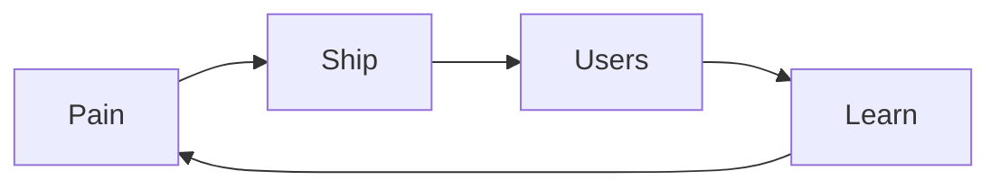

<h2 align="center">Hrushikesh · Vetagiri Hrushikesh</h2>

  Technical founder · Hyderabad · I ship software for problems I've actually felt

  

> Developer learning to be a founder. Building [**Tweak**](https://tweak.page) because client feedback shouldn't travel as screenshot folders.

  
  

  <a href="mailto:hrushikesh.vetagiri@tweak.page">email</a>
  ·
  <a href="https://tweak.page">tweak.page</a>
  ·
  <a href="https://github.com/tweak-page">@tweak-page</a>

