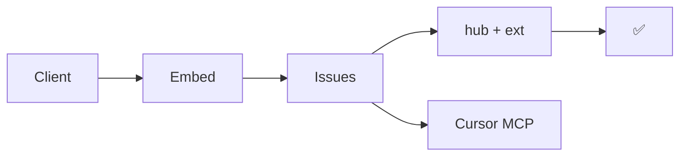

<h2 align="center">Vetagiri Hrushikesh</h2>

  Founder · <a href="https://tweak.page"><strong>Tweak</strong></a> — feedback on the live DOM, not in Slack screenshots

  

  
  

  
  

  <a href="https://tweak.page">tweak.page</a> · <a href="https://tweak.page/docs/mcp">MCP</a>

